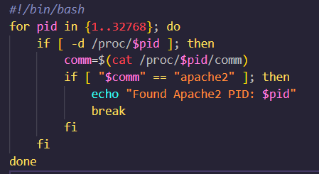
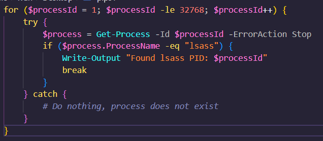
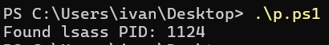
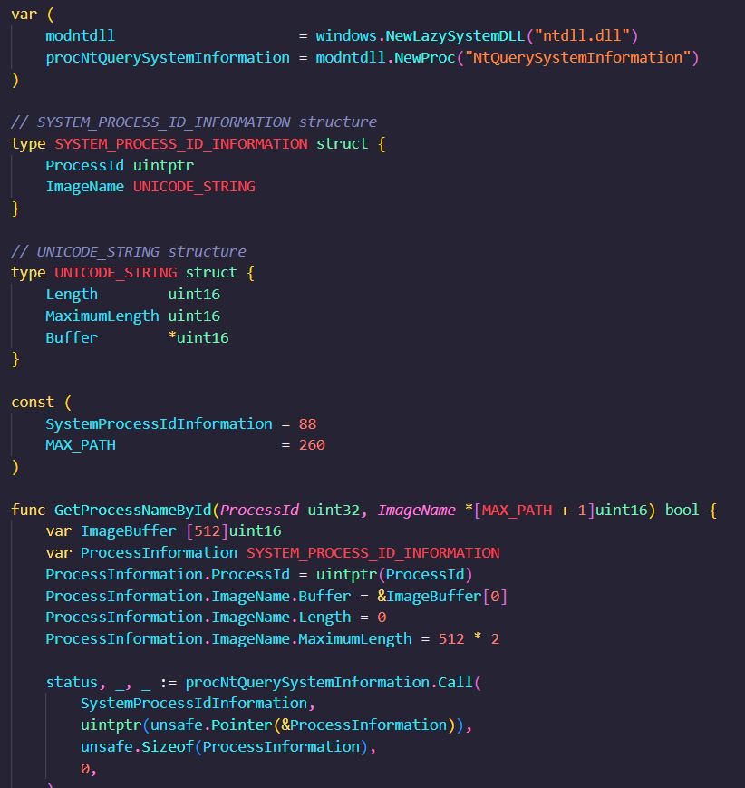
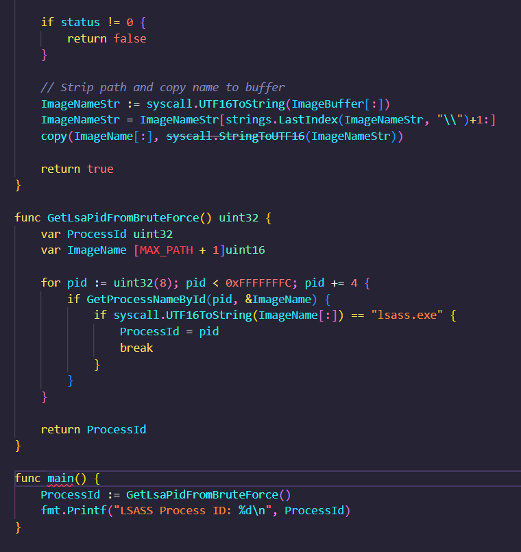

# Read Lsass PID via NtQuerySystemInformation and doing Brute Force

The other day I found a script in Linux which performed brute force to find the Apache PID.

The first thing I thought was... what if we do the same in Windows? So I put together the following script in powershell.

It's not bad, but it's not very stealthy. I can do something better in Go.

