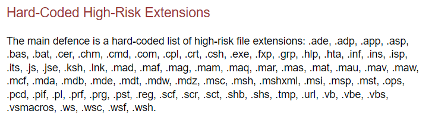
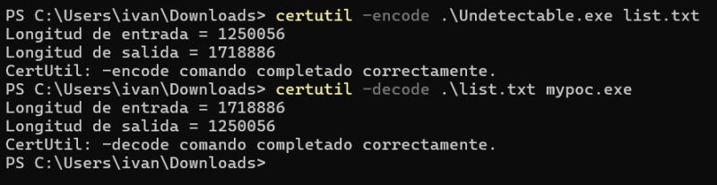

# SmartScreen / MOTW

Windows uses the Mark-of-the-Web (MotW) to indicate that a file originated from the Internet, which gives Microsoft Defender SmartScreen an opportunity to perform additional inspection of the content. MotW also supplies the basis for prompting a user with an additional prompt when high-risk extensions are opened.

AssocGetUrlAction() contains the following risky extensions:

Tricks:

- Use Zip, RAR, ISO or similar files to compress your payload.
- Use weird extensions.
- Use git clone.
- Use Certutil o WScript to download.
- Use Certutil to encode and decode to txt.

