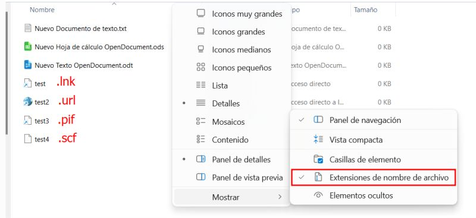
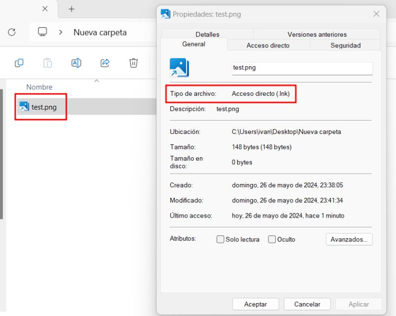

# Hide your extensions

There are files that, even if Windows has 'show file extensions' activated, do not show their extensions.
For example:

.lnk, .pif, .url, .scf etc.

You can use a .lnk file with a name "test.png" and a cool icon.

