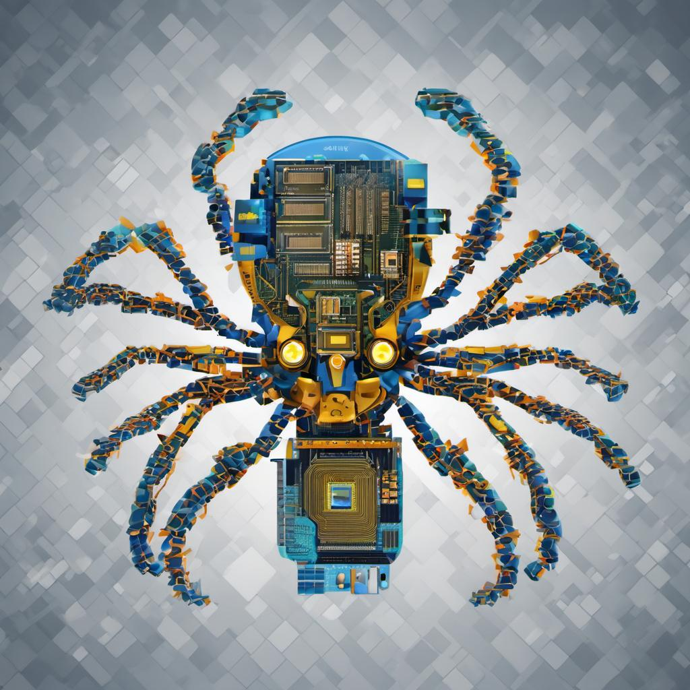

# The-Evasion-Framework

  

  

> [!NOTE]
> This project is created with the objective of providing value in different areas within a Red Team exercise. Here you will find ideas to implement in your projects. We promote research and learning so we do not provide ready-made codes ready to work, only concepts and some PoC. Everything shown below is for educational purposes. 

## Index

### Initial Access
- <a href="NoExtensions.md">No Extensions</a> 
- <a href="SpoofExt.md">Spoof Extensions</a>
- <a href="MOTW.md">SmartScreen / MOTW</a>
- <a href="RegTrick.md">Registry Trick</a>
<!-- - <a href="Phishing.md">Phishing OPSEC</a> -->
  
### Process Injection
- <a href="pHollowing.md">Process Hollowing</a> 
<!-- - <a href="pHypnosis.md">Process Hypnosis</a> -->

### Shellcodes
- <a href="MAC.md">MAC</a> 
- <a href="UUID.md">UUID</a> 
- <a href="String.md">String</a>

### Lsass Dump
- <a href="LsassCommon.md">Common forms and OPSEC Tricks</a>
<!-- - <a href="GetLsass1.md">Get Lsass PID from the registry</a> -->
<!-- - <a href="GetLsass2.md">Get Lsass PID Using doing Brute Forcing</a> -->
<!-- - <a href="GetLsass3.md">Get Lsass PID from the Event Viewer</a> -->

<!-- ### Anti Sandbox -->

<!-- ### Anti Debugging -->

<!-- ### Find Windows Defender Exclusions -->

### Windows Internals
- <a href="Process&Threads.md">Process, Threads, Handles and Jobs</a>
- <a href="WINAPI.md">Offensive Windows APIS</a>
<!-- - <a href="KernelCallbacks.md">Kernel Callbacks Functions</a> -->
