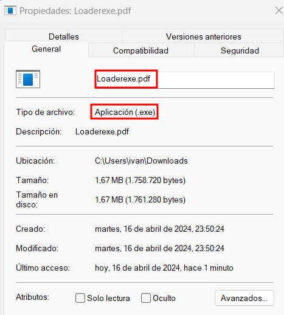

# Spoof Extensions

When it comes to phishing, an .exe or .msi file is more striking than a pdf which, as a general rule, will be safer for a person outside the sector. It's your thing to change the icon too haha.

Technique: https://attack.mitre.org/techniques/T1036/002/
