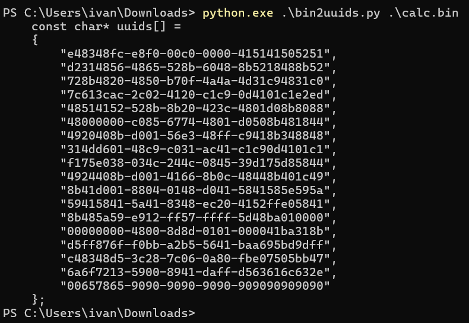

# UUID Obfuscation

Convert your shellcode to this format to reduce detections.
Remember that for this to run, you will need to convert your 'UUID Shellcode' to 'raw'.

Public tool:
https://github.com/boku7/Ninja_UUID_Runner

I recommend creating your own code to implement this technique in your binaries.
